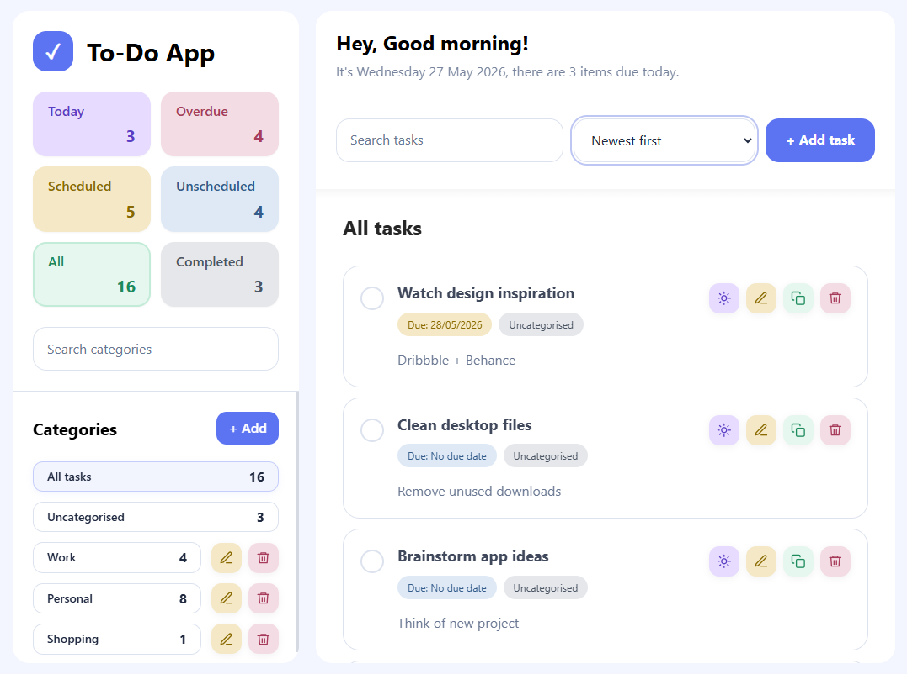
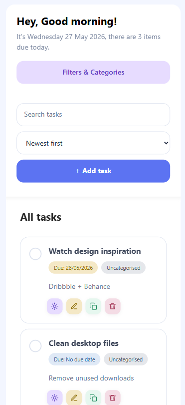
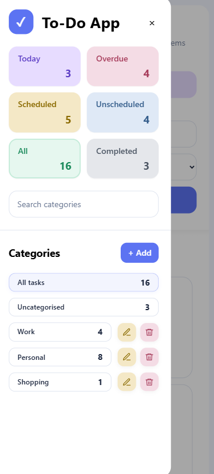

# Todo Frontend

Built with **React**, **TypeScript**, **Vite** and **SCSS Modules**, this task management web application is designed with a soft pastel-inspired visual style, responsive layouts and clean component-driven patterns to create a calm, modern and user-friendly experience while connecting directly to the Todo Backend API.

---

## Screenshots


 

---

## Tech Stack

- React
- TypeScript
- Vite
- SCSS Modules
- Fetch API
- vite-plugin-svgr

---

## Project Purpose

The purpose of this project is to build a polished frontend client for a Todo application.

The project focuses on:

- reusable React components
- typed API service functions
- task and category management workflows
- frontend filtering and derived task counts
- responsive layout behaviour
- modal-based create, edit, duplicate and delete actions
- clean SCSS module styling

This frontend is designed to work with the **Spring Boot Todo Backend API**.

---

## Key Features

### Task Management

Users can:

- create tasks
- edit existing tasks
- duplicate tasks
- mark tasks as complete or incomplete
- set a task due date to today
- delete tasks
- add optional notes
- assign a task to a category
- leave a task uncategorised

### Category Management

Users can:

- create categories
- rename categories
- search categories
- delete categories

Category deletion supports the backend delete modes:

```
keep_tasks
delete_all_tasks
```

#### keep_tasks

- Category is deleted
- Tasks from that category become uncategorised

#### delete_all_tasks

- Category is deleted
- Tasks from that category are removed from the active task list

### Task Filters

The application includes task filters for:

- Today
- Overdue
- Scheduled
- Unscheduled
- All
- Completed

Task counts are calculated on the frontend from the loaded task data.

---

## API Integration

The frontend communicates with the backend through the service layer in:

```
src/services
```

The API base URL is currently configured in:

```
src/services/api.ts
```

Current base URL:

```
http://localhost:8080/api/v1
```

The backend should be running locally on port `8080` before using the frontend.

---

## API Endpoints Used

### Category Endpoints

GET

```
/api/v1/categories
```

POST

```
/api/v1/categories
```

PATCH

```
/api/v1/categories/{id}
```

DELETE

```
/api/v1/categories/{id}?mode=keep_tasks
```

DELETE

```
/api/v1/categories/{id}?mode=delete_all_tasks
```

---

### Task Endpoints

GET

```
/api/v1/tasks
```

POST

```
/api/v1/tasks
```

PATCH

```
/api/v1/tasks/{id}
```

PATCH

```
/api/v1/tasks/{id}/completion
```

DELETE

```
/api/v1/tasks/{id}
```

---

## Project Structure

```
src
├── assets
│   └── icons
│       ├── delete.svg
│       ├── duplicate.svg
│       ├── edit.svg
│       ├── empty.svg
│       ├── restore.svg
│       ├── today.svg
│       └── index.ts
│
├── components
│   ├── categories
│   │   ├── CategoryDeleteModal
│   │   ├── CategoryList
│   │   ├── CategoryListItem
│   │   └── CategorySearch
│   │
│   ├── common
│   │   └── EmptyState
│   │
│   ├── filters
│   │   ├── FilterCard
│   │   └── FilterCards
│   │
│   ├── layout
│   │   ├── MainPanel
│   │   └── Sidebar
│   │
│   └── tasks
│       ├── CompletedTaskList
│       ├── TaskCard
│       ├── TaskDeleteModal
│       ├── TaskFilterChips
│       ├── TaskForm
│       ├── TaskList
│       └── TaskToolbar
│
├── pages
│   └── TodoPage
│
├── services
│   ├── api.ts
│   ├── categoryService.ts
│   └── taskService.ts
│
├── styles
│   ├── _breakpoints.scss
│   ├── _functions.scss
│   ├── _mixins.scss
│   └── _variables.scss
│
├── App.tsx
├── index.scss
├── main.tsx
└── vite-env.d.ts
```

---

## Running the Project

### 1. Clone the repository

```
git clone https://github.com/yourusername/todo-frontend.git
```

### 2. Navigate into the project

```
cd todo-frontend
```

### 3. Install dependencies

```
npm install
```

### 4. Start the backend API

The frontend expects the backend API to be available at:

```
http://localhost:8080/api/v1
```

### 5. Run the frontend

```
npm run dev
```

The Vite development server will start and print the local browser URL in the terminal.

---

## Available Scripts

### Start development server

```
npm run dev
```

### Build for production

```
npm run build
```

## Data Flow

The main application state is managed in:

```
src/pages/TodoPage/TodoPage.tsx
```

This page:

- loads tasks and categories from the backend
- stores active filters and selected category state
- coordinates modal state
- calls task and category service functions
- passes data and event handlers into layout and feature components

The service layer maps backend task responses into frontend-friendly task objects.

---

## Design Goals

This project was designed with the following principles:

- component-based UI structure
- clear separation between UI components and API services
- typed request and response models
- responsive layout for desktop and mobile use
- simple state management with React hooks
- maintainable SCSS module styling
- frontend behaviour aligned with backend business rules

---

## Known Limitations

Current version intentionally excludes:

- authentication
- pagination
- route-based navigation
- automated frontend tests
- advanced API error messages in the UI

These were excluded to keep the project focused on core frontend architecture and API integration.

---

## Future Improvements

Possible future enhancements:

- add toast notifications for success and error states
- add loading and error states per action
- add frontend tests with React Testing Library
- add pagination or infinite scrolling
- add drag-and-drop task ordering
- add authentication-aware screens
- improve accessibility coverage
- deploy the frontend with the backend

---

## Learning Outcomes

This project demonstrates:

- React component architecture
- TypeScript models for frontend data
- API integration with a Spring Boot backend
- frontend state management with hooks
- SCSS module organisation
- responsive application layout
- task filtering and derived UI state

---

## License

This project is released under the **MIT License**.
